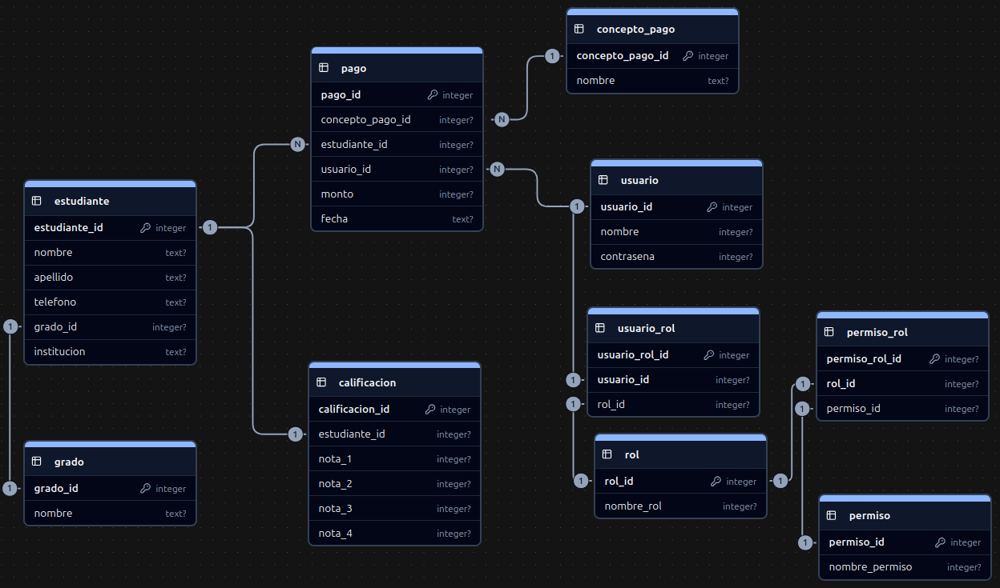

# Sistema de Gestión de Pagos y Notas - Academia

## Descripción del Proyecto

Sistema de gestión académica desarrollado en Python con Tkinter que permite administrar estudiantes, pagos, notas y usuarios con un sistema de permisos robusto.

## Estructura del Proyecto

```
python3-proyecto01/
├── main.py                    # Archivo principal de la aplicación
├── permissions.py             # Sistema de permisos y roles
├── academia.db               # Base de datos principal
├── login.db                  # Base de datos de autenticación
├── assets/                   # Recursos (imágenes, iconos)
│   ├── logo-inicio-sesion.png
│   └── programador.png
├── login/                    # Módulo de autenticación
│   ├── __init__.py
│   └── login.py
├── ingresos/                 # Módulo de gestión de ingresos
│   ├── __init__.py
│   ├── ingresos.py
│   ├── ingresos_ui.py
│   └── ingresos_db.py
├── consultas/                # Módulo de consultas
│   ├── __init__.py
│   ├── consultas.py
│   ├── consultas_ui.py
│   └── consultas_db.py
├── usuarios/                 # Módulo de gestión de usuarios
│   ├── __init__.py
│   ├── registro_usuarios.py
│   ├── usuarios_ui.py
│   └── usuarios_db.py
└── sistema/                  # Entorno virtual Python
```

## Instalación y Configuración

### Paso 1: Clonar o Descargar el Proyecto

```bash
# Si tienes el proyecto en un repositorio
git clone https://github.com/TheAnom/sistema-academia.git
cd python3-proyecto01

# O simplemente navegar al directorio si ya lo tienes
cd /ruta/a/tu/proyecto/python3-proyecto01
```

### Paso 2: Verificar Dependencias

El proyecto utiliza las siguientes librerías principales:
- `tkinter` 
- `sqlite3` 


### Paso 3: Ejecutar la Aplicación

```bash
# Asegúrate de estar en el directorio raíz del proyecto
python main.py

# O si tienes Python3 específicamente:
python3 main.py
```

## 🎯 Funcionalidades del Sistema

### Sistema de Autenticación
- **Login seguro** con validación de credenciales
- **Sistema de roles** (Administrador, Usuario, etc.)
- **Gestión de sesiones** con logout automático

### Gestión de Usuarios
- **Crear usuarios** con roles específicos
- **Modificar información** de usuarios existentes
- **Eliminar usuarios** (con restricciones de seguridad)
- **Protección especial** para usuario administrador principal

### Gestión de Estudiantes
- **Registro de estudiantes** con datos completos
- **Modificación de información** estudiantil
- **Eliminación de registros** (con confirmación)
- **Búsqueda y filtrado** por nombre
- **Autocompletado** inteligente en campos de nombre

### Gestión de Pagos
- **Registro de pagos** por concepto
- **Seguimiento de montos** y fechas
- **Búsqueda por nombre** de estudiante
- **Gestión de conceptos** de pago

### Gestión de Notas
- **Registro de calificaciones** (hasta 4 notas por estudiante)
- **Cálculo automático** de promedios
- **Determinación de aprobación** (promedio >= 60)
- **Modificación y eliminación** de notas

### Sistema de Consultas
- **Consulta de solvencia** de exámenes
- **Visualización de notas** por estudiante
- **Búsqueda avanzada** con autocompletado
- **Reportes de estado** académico

## Características de la Interfaz

### Tema Oscuro
- **Fondo principal:** `#333`
- **Pestañas:** `#555` con texto blanco
- **Botones:** Colores específicos por función
- **Inputs:** Fondo `#444` con texto blanco

### Colores de Botones
- **Eliminar:** Rojo ligero (`#d32f2f`)
- **Guardar:** Verde (`#4caf50`)
- **Modificar:** Naranja ligero (`#ff9800`)
- **Salir:** Gris pastel (`#9e9e9e`)
- **Cerrar sesión:** Azul gris (`#607d8b`)

### Diseño Responsivo
- **Botones uniformes**
- **Inputs consistentes**
- **Tablas optimizadas**

## Base de Datos

### Estructura de Tablas

#### Tabla `usuarios`
```sql
- usuario_id (INTEGER PRIMARY KEY)
- nombre (TEXT)
- contrasena (TEXT)
- rol_id (INTEGER)
```

#### Tabla `estudiantes`
```sql
- estudiante_id (INTEGER PRIMARY KEY)
- nombre (TEXT)
- apellido (TEXT)
- telefono (TEXT)
- institucion (TEXT)
- grado_id (INTEGER)
```

#### Tabla `pagos`
```sql
- pago_id (INTEGER PRIMARY KEY)
- estudiante_id (INTEGER)
- concepto_pago_id (INTEGER)
- monto (REAL)
- fecha (TEXT)
```

#### Tabla `calificaciones`
```sql
- calificacion_id (INTEGER PRIMARY KEY)
- estudiante_id (INTEGER)
- nota1 (REAL)
- nota2 (REAL)
- nota3 (REAL)
- nota4 (REAL)
- promedio (REAL)
- aprobado (INTEGER)
```



## Configuraciónes

### Personalización de Estilos

Para modificar los colores del sistema, edita el archivo `main.py` en la función `create_main_window()`:

```python
# Cambiar color de fondo principal
style.configure("TNotebook", background="#tu_color")

# Cambiar color de botones
style.configure("Save.TButton", background="#tu_color")
style.configure("Delete.TButton", background="#tu_color")
```

Tu eliges los color que mas te gusten es cuestrion de gustos.

### Configuración de Base de Datos

Las bases de datos se crean automáticamente. Para resetear:

```bash
# Puedes eliminar la base de datos existente
rm academia.db

# Ejecutar la aplicación para recrearlas
python main.py
```

## Sistema de Permisos

### Roles Disponibles
- **administrador:** Acceso completo a todas las funciones
- **docente_suplente:** Acceso limitado

### Configuración de Permisos

Edita el archivo `permissions.py` para modificar permisos:

```python
def has_tab_permission(usuario_id: int, tab_name: str, db_path: str = "academia.db") -> bool:
    # Lógica de permisos por pestaña
    pass

def has_action_permission(usuario_id: int, action: str, db_path: str = "academia.db") -> bool:
    # Lógica de permisos por acción
    pass
```

## Solución a algunos porsibles probelmas que se puedan encontrar.

### Error: "command not found: python"
```bash
# Usar python3 en su lugar
python3 main.py

# O verificar instalación de Python
which python3
```

### Error: "No module named 'tkinter'"
```bash
# En Ubuntu/Debian
sudo apt-get install python3-tk

# En CentOS/RHEL
sudo yum install tkinter
```

### Error: "Database is locked"
```bash
# Cerrar todas las instancias de la aplicación
# Verificar que no hay otros procesos usando la BD
lsof academia.db
```

### La imagen no se muestra
- Verificar que `login/logo-inicio-sesion.png` existe
- Comprobar permisos de lectura del archivo
- Verificar formato de imagen (PNG recomendado)

## Uso del Sistema

### 1. Iniciar Sesión
1. Ejecutar `python main.py`
2. Ingresar usuario y contraseña
3. Hacer clic en "Ingresar"

### 2. Gestionar Estudiantes
1. Ir a pestaña "Ingresos"
2. Completar datos del estudiante
3. Hacer clic en "Guardar Estudiante"

### 3. Registrar Pagos
1. Seleccionar estudiante existente
2. Elegir concepto de pago
3. Ingresar monto
4. Hacer clic en "Guardar Pago"

### 4. Ingresar Notas
1. Seleccionar estudiante
2. Ingresar las 4 notas
3. Hacer clic en "Guardar Nota"
4. El sistema calcula automáticamente el promedio

### 5. Consultar Información
1. Ir a pestaña "Consultas"
2. Buscar estudiante por nombre
3. Ver solvencia y notas

## Actualizaciones y Mantenimiento

### Backup de Base de Datos
```bash
# Crear respaldo
cp academia.db academia_backup_$(date +%Y%m%d).db
cp login.db login_backup_$(date +%Y%m%d).db
```

### Actualizar Dependencias
```bash
# Activar entorno virtual
source sistema/bin/activate

# Actualizar pip
pip install --upgrade pip

```

---

**Desarrollado usando Python y Tkinter**

*Última actualización: 03/10/2025*
